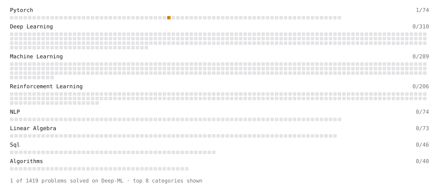

# Deep-ML

My machine learning practice from [Deep-ML](https://www.deep-ml.com). Every solution here was written by hand.

**1** solved · 1 problems · 0 labs · 0 math

[**Browse the interactive portfolio**](https://adiManethia.github.io/deep-ml/) to replay this filling in over time.

## Problems

| | Difficulty | Solved | |
| --- | --- | --- | --- |
| [Gradient of a Weighted Sum of Squares](https://www.deep-ml.com/problems/1223) | medium | 2026-09-18 | [solution](problems/1223-gradient-of-a-weighted-sum-of-squares) |

---

_This file is regenerated by Deep-ML on every push._
